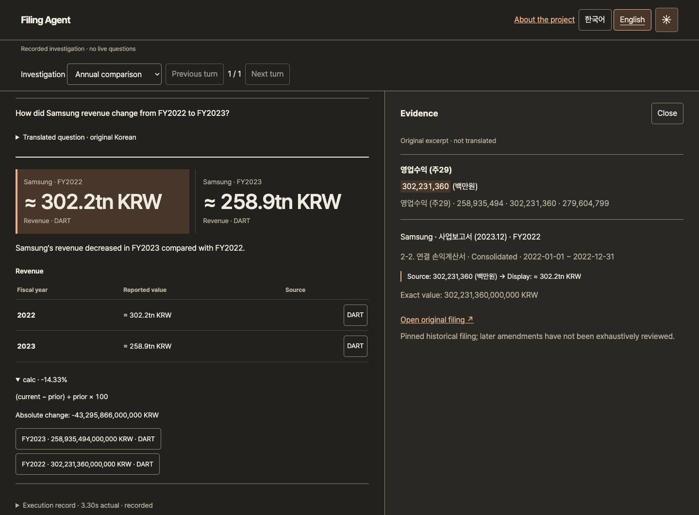

# Filing Agent

A bilingual research workspace for Korean DART and US SEC filings. Ask follow-up questions, compare annual figures and inspect the original evidence. Inference runs locally on a Mac.

**Sister project to [Filing Digest](https://github.com/mhju0/filing-digest).** Digest handles filing ingestion, retrieval and the iOS reader. Agent adds conversational context, annual comparisons and saved investigations. Both projects keep financial figures separate from model-generated prose.

[Explore the recorded investigations](https://filing-agent.vercel.app) · [Engineering notes](https://filing-agent.vercel.app/engineering-en.html) · [Evaluation](evals/RESULTS.md) · [Local setup](#local-setup)

> The local application is implemented and the public replay is deployed. The replay contains actual recorded execution and works without the Mac. Live inference runs only on the owner's machine. Current coverage is 15 verified historical facts across three companies.



## The problem

A follow-up such as “What about NAVER?” leaves the metric and year unstated. The app has to retain the metric and year, switch the company, and check whether the new request has evidence. When one period is missing, borrowing another company's figure can produce a plausible answer with a valid citation and still be wrong.

Filing Agent uses the model to interpret the question, then lets code select evidence and calculate compatible changes. When the collection cannot support a figure, the answer explains what was checked and withholds that figure.

## Relationship to Filing Digest

| Responsibility | Filing Digest | Filing Agent |
|---|---|---|
| Reader experience | SwiftUI company browser, digests and cited Q&A | React investigation workspace with follow-up questions and saved results |
| Filing data | DART/EDGAR ingestion, structured Financial Facts and searchable filing passages | A pinned subset audited against regulator amounts and original filing evidence |
| Model responsibility | KURE-v1 retrieval and Solar narrative generation, separate from financial figures | Local Gemma intent interpretation; code owns figures, calculations and bilingual financial wording |
| Persistence | Filing corpus in PostgreSQL with pgvector | Separate PostgreSQL storage for investigations, snapshots and LangGraph checkpoints |
| Public presentation | [Recorded iOS walkthrough](https://mhju0.github.io/filing-digest/) | [Interactive recorded investigations](https://filing-agent.vercel.app) |

The projects share domain concepts and verified data, with separate runtime responsibilities. Agent does not call Digest's live API, embedding model or Solar service during a question. Of its 15 facts, nine correspond to audited Digest records; six supplement missing Samsung FY2022 and NAVER FY2023 coverage with separately verified regulator evidence. Preparing Agent's snapshot did not change Digest's source or database.

The [coverage audit](docs/audits/2026-09-07-coverage/README.md) pins the inspected Digest revision and records those supplements. The [source snapshot](docs/audits/2026-09-07-coverage/pilot-snapshot.json) preserves filing identity, period, units, original amount and provenance for every figure.

## Explore the application

| Recorded investigation | Behavior to inspect |
|---|---|
| [Annual comparison](https://filing-agent.vercel.app/#scenario=0&turn=0) | Compare Samsung revenue across FY2022 and FY2023; inspect reported amounts and the calculation's source-bound inputs |
| [Company switch](https://filing-agent.vercel.app/#scenario=1&turn=1) | Follow a Samsung revenue question with “What about NAVER?”; preserve metric and year while changing company |
| [Insufficient evidence](https://filing-agent.vercel.app/#scenario=2&turn=0) | Withhold Samsung R&D expenses because the verified collection does not contain that metric; show the checked scope |

The local app accepts new questions in Korean or English. Clarification choices resolve missing context; source inspection shows the original excerpt, original units and displayed value together. Changing the interface language preserves previous local answers. The interface includes light and dark themes, keyboard navigation and a full-height mobile evidence view.

Saved investigations preserve their original answers and evidence snapshot. Continue copies that context into a new investigation; Refresh creates a new investigation against the currently approved snapshot. Editing an earlier question also starts a new investigation.

## Architecture

```text
Evidence preparation, outside the question path
  Audited Filing Digest facts + verified regulator supplements
      -> versioned evidence snapshot

Local question path
  React / TypeScript -> FastAPI -> LangGraph
                                    1. Interpret question: Ollama / Gemma
                                    2. Resolve evidence and calculate: Python / Decimal
                                    3. Persist answer: PostgreSQL

  PostgreSQL retains investigations, evidence snapshots and graph checkpoints.
  Explicit export -> selected recorded turns -> static public replay
```

[Runtime](slice/runtime.py) pins Ollama `0.33.3` and the `gemma4:e4b` weight digest. The model receives the question and conversation context, with JSON Schema output. It receives neither filing text nor financial values. Cloud inference is disabled. The runtime rejects changes to the pinned runtime version or model weights and permits one active request.

[Question/context guards](slice/core.py) check explicit intent, and the shared [financial policy](slice/financial.py) selects eligible figures, calculates comparisons and constructs bilingual answers. [Workflow execution](slice/workflow.py) records three actual stages, with no simulated retrieval or extraction progress. The [investigation lifecycle](slice/lifecycle.py) owns durable completion and storage recovery; PostgreSQL checkpoints retain graph position.

## Decisions backed by failures

| Observed problem | Implementation decision | Trade-off |
|---|---|---|
| Models selected correct source IDs while incorrectly saying revenue increased; Qwen also invented missing R&D as zero | Restrict the model to intent interpretation and construct financial answers in code | Less expressive prose; financial wording and arithmetic can be inspected and tested |
| A company-free question produced a model guess | Validate explicit entities against accepted context and persist pending clarification separately | Ambiguous questions require an additional turn |
| A process can stop between interpretation and saving an answer | Persist completed stages; mark interrupted work; permit one explicit retry that reuses completed outputs | Recovery resumes a stage, not individual generated tokens |
| New evidence can change a previously saved answer | Keep the original snapshot immutable and create a new investigation for a rerun | Historical results remain separate from refreshed results |
| Local inference competes for limited memory | Run one request at a time, use a 120-second interpretation deadline, and confirm model unload on cancellation | Concurrent requests are rejected while one is active; confirming a stop can extend timeout handling |

See the [model experiments](bench/runs/2026-09-07/README.md) and [workflow decision record](docs/adr/0006-persisted-local-workflows-and-release-scope.md) for the failed alternatives and implementation boundaries.

## Evaluation

The release evaluation ran 40 scenarios held out from execution three times: **120 scenario runs and 138 actual conversation turns**. Each trial contained 20 Korean and 20 English scenarios.

| Language | Supported answers, each trial | Withholding or clarification, each trial | Total across three trials |
|---|---:|---:|---:|
| Korean | 10/10 | 10/10 | 60/60 |
| English | 10/10 | 10/10 | 60/60 |

No source/value mismatch appeared in the recorded outputs. On an M1 Pro with 16 GiB RAM, per-turn latency was **2.96 seconds median**, **3.19 seconds observed p95**, and **9.78 seconds maximum**. Most requests used a loaded model; the first turn included loading. Concurrent app/browser profiling observed both normal and warning memory pressure.

The implementing agent authored the scenarios. They share task families, companies and metrics with the development set; repeated runs use a fixed deterministic configuration. These results measure the guarded application on this collection. They do not establish independent accounting review or general financial-language accuracy.

The architecture refactor passed 17 application tests and 31 benchmark tests, with 1,800 financial outputs unchanged across extraction. Separate checks exercised storage failure and uncertain commits, retry, cancellation and saved-result preservation, plus the browser interface in both languages and themes on desktop and mobile. The original held-out run blocked application/model outbound traffic except localhost. The public replay was checked with local services stopped. [Architecture verification](docs/audits/2026-09-08-architecture/README.md) separates current checks from the earlier model evaluation.

[Evaluation method](evals/README.md) · [Results](evals/RESULTS.md) · [Release audit](docs/audits/2026-09-08-slice/README.md)

## Local setup

Tested on Apple Silicon with 16 GiB RAM. Install Python 3.11, Node 24, PostgreSQL 16 command-line tools and Ollama 0.33.3. Download `gemma4:e4b` and set `disable_ollama_cloud` to `true` in `~/.ollama/server.json`, preserving other settings. The app checks the pinned weight digest; runtime or model changes require requalification. No Ollama account is required for this local configuration.

```sh
python3.11 -m venv .venv
.venv/bin/pip install -r slice/requirements.lock
npm ci --prefix slice/web
npm run build --prefix slice/web
./slice/scripts/database.sh
```

Start these in separate terminals after stopping any existing Ollama server:

```sh
./bench/serve.sh
```

```sh
./slice/scripts/serve.sh
```

Open **http://127.0.0.1:8765**. Agent uses a separate native PostgreSQL cluster on port `55439`; it does not connect to Digest's database. Package and model installation require internet. Questions over the installed snapshot use local services.

[Operating guide](slice/README.md) covers the exact model digest, shutdown, private backup/restore, retention, diagnostics and replay export. The [public source archive](https://filing-agent.vercel.app/filing-agent-source.zip) includes the application and setup instructions without private planning or repository history.

## Verification commands

With the Agent database running:

```sh
.venv/bin/python -m unittest discover -s slice/tests -v
.venv/bin/python -m unittest discover -s bench/tests -v
npm run build --prefix slice/web
```

For browser checks, install `npm ci --prefix verification`, start the local app and Ollama, then run `node slice/scripts/verify-browser.mjs`. The [evaluation runner](evals/README.md) executes fresh scenarios through the real local API and preserves failed runs.

## Coverage and security scope

| Company | Fiscal years | Verified metrics |
|---|---|---|
| Samsung Electronics | 2022, 2023 | Consolidated revenue, operating income, as-reported net income |
| NAVER | 2023 | Same three metrics |
| Microsoft | 2023, 2024 | Same three metrics; fiscal year ends in June |

The snapshot is historical. It does not cover every later amendment, arbitrary financial metric or business-cause explanation. Missing R&D evidence means the metric is outside this verified collection, not absent from the company's full filing. DART navigation was checked for the recorded filings; SEC denied automated browser navigation. Original links do not promise exact table-cell positioning or permanent availability.

The app is a single-owner local service. Exact loopback Host/Origin checks and a mutation token protect the browser API; they do not protect against a compromised local account. PostgreSQL uses loopback trust authentication. Ordinary investigations expire after 30 idle days, saved results remain until deleted, and explicit backups may retain deleted data. Raw model diagnostics require opt-in and expire after 24 hours while the app is running.

The public site serves selected static recordings, with no question API, sign-in or connection to the Mac. Production cloud operations, multi-user isolation and 8 GiB support have not been evaluated.

## Source guide

The [documentation index](docs/README.md) links current guides, architecture decisions, verification records and design studies.

| Path | Responsibility |
|---|---|
| [`slice/`](slice/) | Local application, financial policy, persistence and React interface |
| [`bench/`](bench/) | Local model experiments and benchmark harnesses and recorded model results |
| [`evals/`](evals/) | Development and held-out conversation scenarios, runner and recorded results |
| [`docs/adr/`](docs/adr/) | Architecture decisions and alternatives |
| [`docs/audits/`](docs/audits/) | Evidence verification, real execution, browser checks and release records |
| [`release/`](release/) | Explicit source allowlist and verified static deployment |

## License

Copyright (c) 2026 Michael Ju. All rights reserved. The public source archive is available for portfolio review; no open-source license is granted for original project code. Dependency, model and bundled font licenses apply separately.

Release follow-up: [approved remediation and coverage boundaries](docs/audits/2026-09-09-remediation/README.md). Digest now has 18 local companies; Agent retains its separately qualified three-company snapshot.
