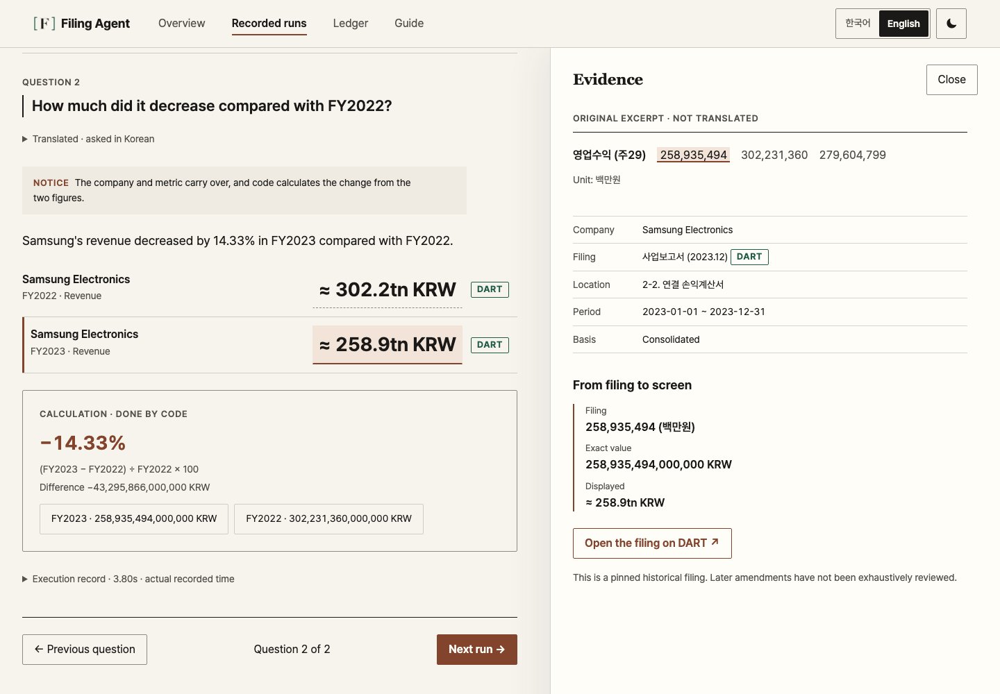

<picture>
  <source media="(prefers-color-scheme: dark)" srcset="docs/design/logos/mark_dark.svg">
  
</picture>

# Filing Agent

Ask questions about company filings and compare the figures.

**[Open the recorded demo](https://filing-agent.vercel.app)** · Korean and English · no install

[Engineering notes](https://filing-agent.vercel.app/engineering-en.html) · [Sister project: Filing Digest](https://github.com/mhju0/filing-digest)

Filing Agent is a local web app for asking follow-up questions about verified historical Korean (DART) and US (SEC) filings. Each answer keeps the reported figures, the calculation and the original filing excerpt in view. Saved answers keep the evidence they were built on.

The demo replays real runs recorded on the local app. It makes no model calls and needs nothing running on the owner's Mac.

**Status:** Maintenance · [release policy and limits](docs/MAINTENANCE.md) · [dated release](https://github.com/mhju0/filing-agent/releases/tag/release-qualified-2026-10-06)

## In the demo

| Recorded run | What to look for |
|---|---|
| [Revenue, then a year comparison](https://filing-agent.vercel.app/#scenario=0&turn=0) | The follow-up keeps the company and metric; code calculates the −14.33% change |
| [“What about NAVER?”](https://filing-agent.vercel.app/#scenario=1&turn=1) | The company changes; the metric and year carry over |
| [Samsung R&D expenses](https://filing-agent.vercel.app/#scenario=2&turn=0) | Outside the verified collection, so the answer shows what was checked and withholds a figure |
| [Ledger](https://filing-agent.vercel.app/#ledger) | All 15 verified figures with their filings |

## How it works

- A local model (Gemma through Ollama) only interprets the question. It never receives filing text or financial values.
- Code selects the evidence, calculates with `Decimal` and writes the answer in Korean or English.
- A request that names a company or scope outside the collection gets a clarifying question, not a quietly narrowed answer.
- FastAPI and LangGraph run the stages. PostgreSQL stores investigations, evidence snapshots and checkpoints, so an interrupted run can be retried and a saved answer never changes.

The split came from failures: in [model experiments](bench/runs/2026-09-07/README.md), models chose the right source and still said revenue increased when it fell.

## Key facts

| | |
|---|---|
| Stack | Python 3.11 · FastAPI · LangGraph · PostgreSQL 16 · Ollama (`gemma4:e4b`) · React + TypeScript |
| Coverage | 15 verified figures: revenue, operating income and as-reported net income for Samsung Electronics FY2022–2023, NAVER FY2023 and Microsoft FY2023–2024 |
| Tests | 57 policy and 19 application tests passed in the [Sept 11, 2026 verification](docs/audits/2026-09-10-final-polish/README.md); the policy tests were re-run Oct 2, 2026 |
| Model evaluation | One fresh held-out trial: 20/20 Korean and 20/20 English scenarios. The earlier [release evaluation](evals/RESULTS.md) passed all 120 scenario runs, with a 2.96 s median per turn on an M1 Pro |
| Runs on | Apple Silicon Mac with 16 GiB RAM (tested). Inference stays on the machine |

Nine of the 15 figures match audited Filing Digest records; six were verified separately against regulator filings. Agent does not call Digest during a question.

## Run locally

Requires Python 3.11, Node 24, PostgreSQL 16 command-line tools and Ollama 0.33.3. The [operating guide](slice/README.md) covers setup, the pinned model digest, tests, backups and replay export.

## Limits

- The snapshot is historical. It does not cover later amendments, other metrics or explanations of business causes.
- It is a single-owner local service. Multi-user and cloud operation have not been evaluated.
- The implementing agent authored the evaluation scenarios. Results describe this guarded app on this collection, not general financial-language accuracy.

## Documentation

[Documentation index](docs/README.md) · [Architecture decisions](docs/adr/README.md) · [Evaluations](evals/README.md) · [Verification records](docs/audits/README.md)

## License

Copyright (c) 2026 Michael Ju. All rights reserved. The public source archive is available for portfolio review; no open-source license is granted for original project code. Dependency, model and bundled font licenses apply separately.
