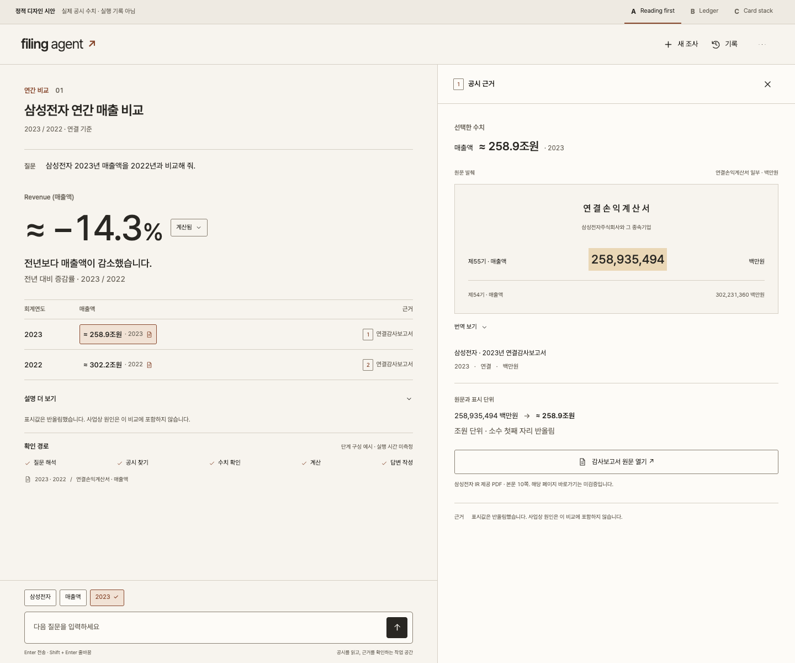
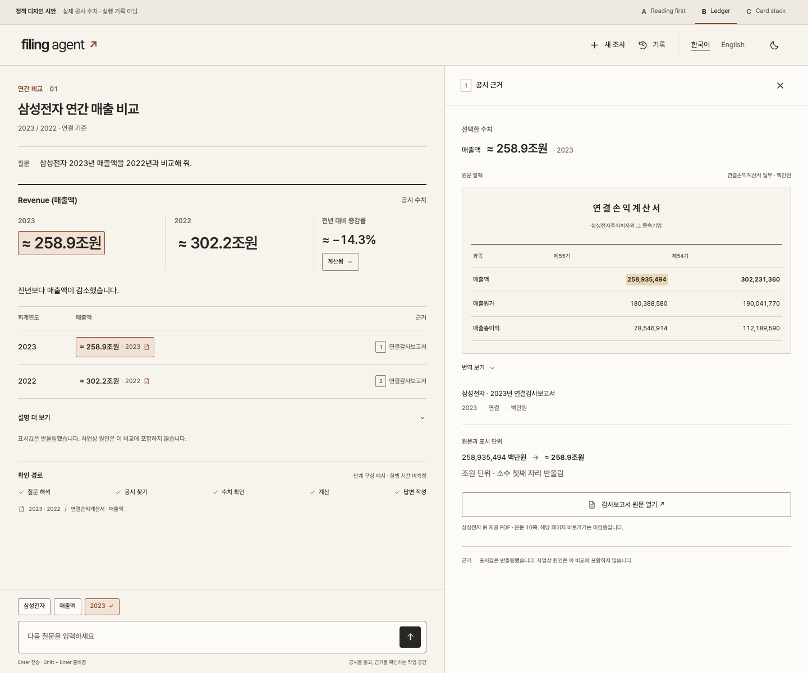
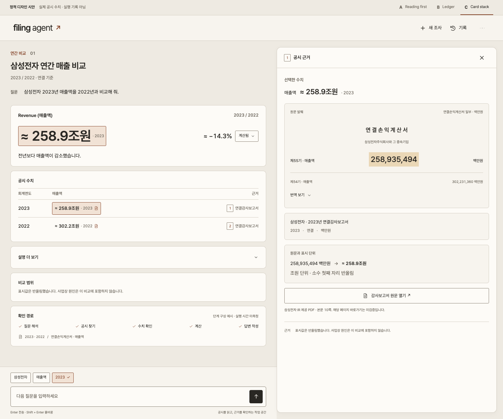
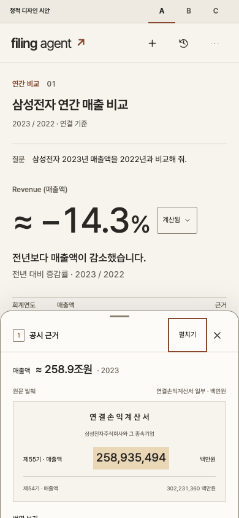
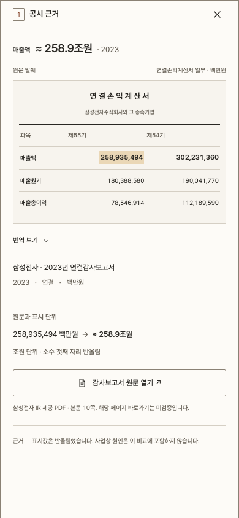
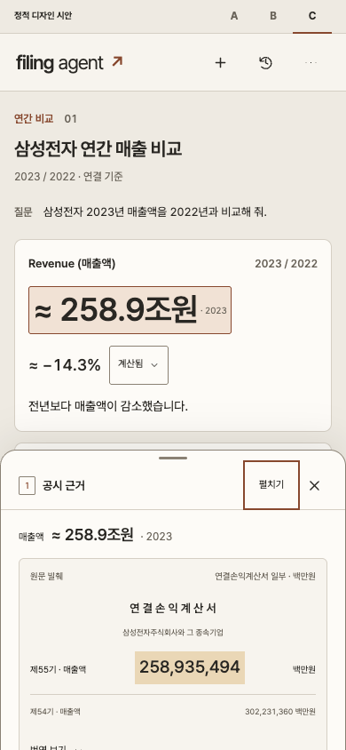

# Filing Agent: three investigation-screen alternatives

Three static React + Tailwind studies of the **same Samsung revenue comparison**. No model, backend, or captured live execution is involved. On September 7 the owner selected **B: Ledger**. Ledger and the default entry now expose language/theme controls in the top bar and use a single full-height mobile evidence view. A/C remain earlier comparison studies. The original [decisions and task](DECISIONS.md) are retained below a supersession notice; [ADR 0004](../../docs/adr/0004-ledger-and-prebuild-gates.md) records current direction.

## Compare the screens

Desktop: 1440 × 1200, Korean, light theme. The taller capture includes the completed illustrative search trail and bottom composer in each layout. Both desktop panels scroll independently at shorter viewport heights.

| A · Reading first | B · Ledger | C · Card stack |
| --- | --- | --- |
| [](screenshots/a-desktop.png) | [](screenshots/b-desktop.png) | [](screenshots/c-desktop.png) |

Mobile: 390 × 844. Ledger shows its single full-height evidence view after tapping a figure; it starts with the conversation visible. A/C retain the earlier 40% peek detent and drag/expand controls for comparison. Close evidence to return to the selected figure. The focus indicator in conversation screenshots is intentional keyboard-access evidence.

| A · Reading first | B · Ledger | C · Card stack |
| --- | --- | --- |
| [](screenshots/a-mobile.png) | [](screenshots/b-mobile.png) | [](screenshots/c-mobile.png) |

Five comparison lines per alternative:

| Criterion | A · Reading first | B · Ledger | C · Card stack |
| --- | --- | --- | --- |
| Readability | A large change figure and sentence establish a linear reading order. | Adjacent reported amounts and ruled rows support scanning between periods. | Separate surfaces make each answer section easy to locate. |
| Hierarchy | Percentage change is primary; reported values supply scale beneath it. | The two reported figures are primary; change occupies a smaller third column. | Current revenue leads its own card; comparison rows and explanation occupy separate cards. |
| Source discoverability | The quiet document column follows the selected figure without competing with the answer. | The mini statement table preserves the relationship between both periods and nearby metrics. | Bounded excerpt, metadata, and conversion sections echo the answer's card structure. |
| Korean/English fit | Short Korean copy leaves more space; English uses wrapped unit labels and explanations. | Tabular figures remain aligned; longer English source names wrap in narrow layouts. | Cards accommodate English wrapping, with additional vertical height. |
| Mobile trade-off | The change and conclusion remain above the peek sheet; underlying rows require closing or scrolling. | Conversation and full-height evidence have separate reading space; close evidence to compare another figure. No detents or drag gesture to learn. | The first card remains visible above the sheet; later cards take more vertical travel. |

## Open the interactive studies

```sh
cd design/alternatives
npm ci --cache .npm-cache
npm run dev -- --port 4173
```

- [A · Reading first](http://127.0.0.1:4173/a.html)
- [B · Ledger](http://127.0.0.1:4173/b.html)
- [C · Card stack](http://127.0.0.1:4173/c.html)

Use the top A/B/C links to switch composition. Ledger exposes `한국어 / English` and a sun/moon theme button directly beside History; on mobile the controls occupy a deliberate second row. A/C retain their original overflow controls. The first theme follows the system; the screenshot runner explicitly selects light. Theme initialization runs before first paint; preferences remain local.

Click a figure or filing chip to inspect that period, expand `계산됨 / calc` to see the formula and both source operands, open the explanation or labeled translation, and try the History drawer. New investigation opens a prototype explanation and focuses a fresh draft in the current static screen; it does not create a persisted investigation. Sending a question produces an explicit static-prototype message and preserves the draft. Context chips explain the fixed study context rather than pretending to edit a running investigation.

## Additional captures

| State | A | B | C |
| --- | --- | --- | --- |
| Formula and translation expanded | [A](screenshots/a-formula.png) | [B](screenshots/b-formula.png) | [C](screenshots/c-formula.png) |
| English, dark, desktop | [A](screenshots/a-english-dark.png) | [B](screenshots/b-english-dark.png) | [C](screenshots/c-english-dark.png) |
| Mobile conversation, sheet closed | [A](screenshots/a-mobile-conversation.png) | [B](screenshots/b-mobile-conversation.png) | [C](screenshots/c-mobile-conversation.png) |
| English, dark, mobile conversation | [A](screenshots/a-mobile-english-dark.png) | [B](screenshots/b-mobile-english-dark.png) | [C](screenshots/c-mobile-english-dark.png) |

## Design read and scope

The screen's job is to compare annual revenue and make the reported operands inspectable. All three share warm paper/ink surfaces, a restrained brown accent for selected evidence, Pretendard, and tabular numerals; composition provides the difference. Local font files and their [license](public/fonts/OFL.txt) are included. No external font service is used.

Antislop is applied during implementation. Dials: **ENERGY 1**, **MOTION 1**; **RHYTHM 2** for A/B and **RHYTHM 1** for the explicitly requested repeated-card study C. A's large change, B's paired amounts, and C's first result card are their respective focal points. Selected source references and the matching excerpt highlight form the repeated evidence motif. Borders separate records; shadows are limited to sheets/dialogs. There are no decorative charts, invented citations, or artificial waiting animations.

UI UX Pro Max's first broad search produced an unrelated portfolio layout and was not adopted. Focused reading/line-height and responsive-layout guidance was applied to the owner's brief. Emil's guidance informed stable controls, immediate keyboard behavior, explicit interaction state, and restrained press feedback. Reduced motion removes movement.

The brief's identity default asked to share Digest's type family, while its explicit typography default named Pretendard. Read-only inspection found Digest uses system New York/SF families. Selecting Ledger retains Pretendard as the implementation baseline, shares the warm neutral direction, and keeps a distinct accent and typographic wordmark; an identical font family is not required.

## Evidence honesty

- `src/data.js` imports `../../../bench/fixtures/samsung_is.json` relative to that source file, without modifying it. Original revenue is **258,935,494** and **302,231,360** 백만원. Calculations use integer arithmetic before display rounding: change **−14.33%**, displayed approximately as **−14.3%**. Rounded figures carry `≈`.
- Excerpts are **reconstructed statement fragments**, not screenshots of a regulator viewer. B includes cost of sales and gross profit from the same fixture. The original Korean terminology and values remain visible when translation is expanded.
- The fixture's actual source is Samsung IR's [2023 consolidated audit report](https://images.samsung.com/kdp/ir/financial-info/2023/2023_con_quarter04_all.pdf), printed page 10. It does not contain a verified DART receipt link. The prototype therefore labels the external link **audit report**, identifies Samsung IR, and does not claim `(해당 페이지)`. This evidence limitation is exposed in the panel instead of inventing a DART identifier.
- The completed step list is explicitly labeled **illustrative stages, execution time unmeasured**. It demonstrates the layout, not LangGraph behavior or a real recorded run.
- The highlighted 2023 context chip is a frozen illustration of the requested changed-chip state. No fictional prior turn or elapsed duration is invented.
- English text is prepared static study content. Toggling it compares localized assets; it does not demonstrate rewriting past live answers or local machine translation.

No scenario tabs, saved-result persistence, cancellation engine, coverage inventory, source-catalog migration, model installation, or production API are implemented by these single-investigation studies. The additional replay scenarios remain outside this task.

## Verification

```sh
npm run build
npm run preview -- --port 4174
# In a second terminal in this directory; Google Chrome must be installed:
npm run verify
```

The browser script checks the **production build**, writes reproducible screenshots and [verification.json](verification.json), and blocks external page requests. `DESIGN_URL` can point it at another local preview port. Build output is static and can be served without the repository or the Mac runtime; dependencies and the benchmark fixture are bundled at build time.

See [verification notes](VERIFICATION.md) for the Antislop gate, concrete checks, and remaining device-testing limits. Browser/test dependencies are development-only. Application runtime dependencies are React and React DOM; there is no UI component library or animation framework.
